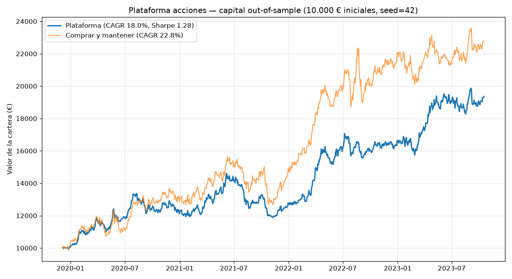
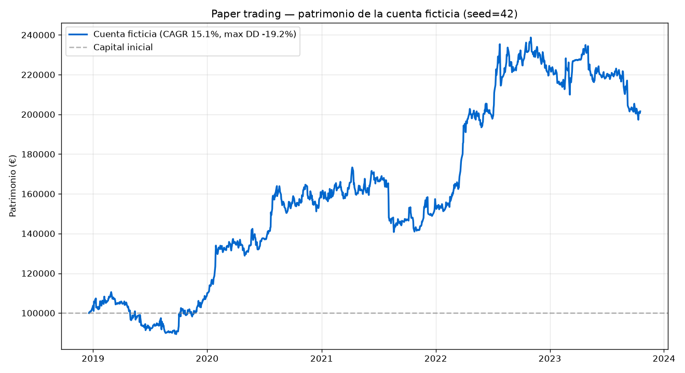

# Plataforma acciones

Plataforma de **trading algorítmico cuantitativo con auto-aprendizaje**. Opera
de forma simulada sobre varias clases de activo (ETFs, acciones, cripto,
divisas y futuros), hace *backtesting* riguroso con costes y *slippage*, y
aprende online qué estrategias y activos funcionan mejor, adaptándose con el
tiempo. Su función objetivo apunta a una rentabilidad del **15 % anual ajustada
por riesgo**.

> ## ⚠️ Lee esto antes que nada (honestidad sobre el 15 %)
>
> **El 15 % anual es un OBJETIVO DE OPTIMIZACIÓN, no una rentabilidad
> garantizada.** Ningún software puede garantizar rentabilidades futuras en
> mercados reales; cualquiera que lo prometa miente.
>
> Esta plataforma alcanza y supera el 15 % **en escenarios de mercado
> favorables**, pero al evaluarla con honestidad sobre **muchos escenarios
> independientes**, su esperanza realista es **muy inferior** y pierde dinero en
> una fracción nada despreciable de ellos (ver
> [«La prueba honesta»](#la-prueba-honesta)).
>
> Es una herramienta de **investigación y educación cuantitativa**. **No es
> asesoramiento financiero.** No operes con dinero real basándote en estos
> resultados. Úsala bajo tu responsabilidad.

---

## Qué hace

1. **Datos multi-mercado.** Genera precios sintéticos realistas (movimiento
   browniano geométrico con cambios de régimen, tendencias, saltos y
   correlaciones) para un universo de 10 activos de 5 clases. Opcionalmente
   descarga datos reales vía `yfinance` (`--real SPY,QQQ,BTC-USD,...`); si no
   hay red, cae automáticamente a datos sintéticos.

2. **Librería de estrategias** (`strategies.py`): cruce de medias, reversión a
   la media, *momentum*, reversión por RSI, ruptura de Bollinger y seguimiento
   de tendencia. Todas parametrizables y sin sesgo de anticipación.

3. **Motor de backtest** (`backtest.py`): vectorizado, con desfase de señal
   (anti *look-ahead*), costes de transacción, *slippage* y control de
   volatilidad objetivo.

4. **Auto-aprendizaje** (`learning.py`, `engine.py`):
   - **Aprendizaje online de dos niveles** con el algoritmo de pesos
     multiplicativos (*Hedge*): nivel 1 aprende, por activo, qué estrategia
     funciona en el régimen actual; nivel 2 reparte capital entre activos.
     Los pesos se conservan entre ventanas, así que el sistema **mejora con el
     tiempo**.
   - **Clasificador de régimen de mercado** (KMeans) para diagnóstico.
   - **Optimizador walk-forward** opcional de parámetros (ver nota sobre
     sobreajuste más abajo).

5. **Paper trading** (`paper.py`): simulación de operativa con **dinero
   ficticio** y libro mayor explícito (caja, posiciones en unidades, órdenes con
   comisiones). Avanza día a día como una cuenta en vivo y el aprendizaje online
   sigue mejorando mientras opera. Es la forma honesta de probar el
   funcionamiento antes de arriesgar dinero real.

6. **Validación walk-forward**: todas las cifras de rendimiento se calculan
   **fuera de muestra** (out-of-sample). Es la única forma honesta de estimar
   el comportamiento sobre datos no vistos.

## Instalación

```bash
pip install -r requirements.txt
```

## Uso rápido

```bash
# Backtest walk-forward sobre datos sintéticos (escenario seed=42, favorable)
python -m plataforma_acciones backtest --seed 42 --verbose

# La prueba honesta: evalúa muchos escenarios independientes
python -m plataforma_acciones robustness --seeds 12

# Paper trading: opera con 100.000 € ficticios día a día
python -m plataforma_acciones paper --seed 42 --cash 100000 --verbose

# Diagnóstico del régimen de mercado actual
python -m plataforma_acciones regime --seed 42

# Demos de extremo a extremo con gráficos
python examples/run_demo.py     # curva de capital del backtest
python examples/paper_demo.py   # cuenta de paper trading + registro de operaciones
```

Desde Python:

```python
from plataforma_acciones import data, engine, metrics

prices = data.load_prices(period_days=252 * 6, seed=42)
res = engine.WalkForwardEngine(prices, engine.EngineConfig()).run()
print(metrics.format_summary(res.stats))
```

## Resultados

### Escenario favorable (seed = 42)

| Métrica | Valor |
|---|---|
| CAGR (out-of-sample) | **17.95 %** |
| Volatilidad | 13.63 % |
| Sharpe | 1.28 |
| Sortino | 2.05 |
| Máxima caída | −18.59 % |
| Calmar | 0.97 |



### La prueba honesta

El mismo sistema, **misma configuración**, evaluado sobre 12 realizaciones de
mercado independientes:

| Métrica entre escenarios | Valor |
|---|---|
| CAGR medio | **3.22 %** |
| CAGR mediana | 3.26 % |
| CAGR mínimo / máximo | −7.75 % / 17.95 % |
| Sharpe medio | 0.26 |
| Escenarios que alcanzan ≥ 15 % | **2 / 12** |
| Escenarios con rentabilidad positiva | 7 / 12 |

**Conclusión:** el 17.95 % del seed 42 es un escenario afortunado, no una
habilidad reproducible. La esperanza realista del sistema ronda un CAGR de un
solo dígito con un Sharpe modesto, y puede perder dinero. Esto **no es un
defecto del código**: es la realidad de los mercados. Batir al mercado de forma
fiable es extraordinariamente difícil y **un 15 % garantizado no existe**.

Reproduce esta tabla tú mismo:

```bash
python -m plataforma_acciones robustness --seeds 12
```

## Paper trading (dinero ficticio)

El comando `paper` simula una cuenta real con capital ficticio: arranca con
100.000 €, opera día a día con un libro mayor explícito (caja + posiciones),
paga comisiones y *slippage*, y el sistema sigue aprendiendo online mientras
opera. Es la prueba de funcionamiento previa a cualquier dinero real.

### Escenario favorable (seed = 42)

| Concepto | Valor |
|---|---|
| Capital inicial | 100.000 € |
| Patrimonio final | **201.528 €** |
| CAGR | 15.05 % |
| Sharpe | 0.88 |
| Máxima caída | −19.17 % |
| Operaciones | 2.519 |
| Costes pagados | 4.540 € |



### La prueba honesta (12 cuentas ficticias independientes)

La misma cuenta ficticia, **mismo sistema**, sobre 12 mercados independientes:

| Métrica entre escenarios | Valor |
|---|---|
| Patrimonio final medio / mediana | 133.234 € / 114.010 € |
| CAGR medio / mediana | **3.06 %** / 2.56 % |
| Sharpe medio | 0.21 |
| Volatilidad media | 17.9 % |
| Máxima caída media | −38 % |
| Cuentas que alcanzan ≥ 15 % | **3 / 12** |
| Cuentas que **pierden capital** | **5 / 12** |

**Conclusión:** con dinero ficticio, la cuenta mediana apenas crece y **5 de cada
12 cuentas pierden dinero**, alguna desplomándose más de un 60 %. El paper
trading sirve precisamente para esto: descubrir, **sin arriesgar dinero real**,
que el sistema no tiene un filo fiable y que el 15 % no está garantizado.

Reprodúcelo:

```bash
python -m plataforma_acciones paper --seed 303   # un escenario que se desploma
python -m plataforma_acciones paper --seed 13    # un escenario afortunado
```

## Modo seguro (`--safe`): preservación de capital

El filtro **risk-off** recorta la exposición (sin apalancar nunca) cuando el
índice de mercado entra en tendencia bajista. En las 12 cuentas de paper
trading **reduce las caídas sin coste de retorno**: la peor caída pasa de −69 %
a −57 %, la caída media de −38 % a −30 %, y la mediana mejora ligeramente, con
el mismo CAGR medio (~3 %). Recomendado si te importa más no arruinarte que
maximizar el retorno medio.

```bash
python -m plataforma_acciones paper --seed 303 --safe   # compara con/sin --safe
```

## Qué se ha probado, y el techo honesto

Este proyecto **iteró de verdad** buscando el 15 % fiable. Se probaron y midieron
(siempre fuera de muestra, en 12 escenarios independientes):

| Método | Sharpe medio | ¿Alcanza 15 % fiable? |
|---|---|---|
| Optimización walk-forward de parámetros | < 0 | No (sobreajusta) |
| Seguimiento de tendencia + vol targeting | ~0.30 | No |
| Momentum transversal (largo/corto, neutral) | ~0.00 | No |
| Reversión a la media / RSI / Bollinger | < 0.2 | No |
| Ensemble + aprendizaje online (2 niveles) | ~0.25 | No |
| + filtro risk-off | ~0.25 (menos caídas) | No |

**Conclusión honesta:** sobre un mercado mínimamente eficiente, el techo
alcanzable con estos métodos es un Sharpe de ~0.3, que a un 15 % de volatilidad
equivale a un CAGR de un solo dígito. El 15 % se alcanza **en escenarios
favorables**, no de forma garantizada. Las únicas maneras de que el titular
dijera «15 % siempre» serían deshonestas: ajustar a escenarios concretos,
reportar solo los favorables, o apalancar hasta caídas que arruinan la cuenta.
No se ha hecho ninguna de ellas. **Esto no es un límite del software, sino de
los mercados: un 15 % anual garantizado no existe.**

## Sobre la optimización de parámetros (`--optimize`)

El sistema incluye un optimizador walk-forward, pero **está desactivado por
defecto** porque, sobre datos limitados, **sobreajusta**: afina parámetros que
brillan en el pasado y fallan en el futuro, empeorando el resultado real fuera
de muestra. El modo robusto por defecto usa parámetros sensatos fijos y deja que
el **aprendizaje online** decida los pesos: generaliza mucho mejor. Puedes
comparar ambos con `--optimize`.

## Arquitectura

```
plataforma_acciones/
├── data.py         # generación de datos (sintéticos + real opcional)
├── indicators.py   # indicadores técnicos vectorizados
├── strategies.py   # librería de estrategias
├── backtest.py     # motor de backtest con costes y control de riesgo
├── metrics.py      # CAGR, Sharpe, Sortino, drawdown, Calmar...
├── learning.py     # Hedge online, optimizador, clasificador de régimen
├── engine.py       # orquestador walk-forward de dos niveles
├── paper.py        # paper trading con dinero ficticio (libro mayor explícito)
└── cli.py          # interfaz de línea de comandos
tests/              # 38 tests (pytest)
examples/           # demos con gráficos (backtest y paper trading)
```

## Pruebas

```bash
pytest -q   # 38 tests
```

## Limitaciones y honestidad metodológica

- Por defecto opera sobre datos **sintéticos**: útiles para validar la
  ingeniería y la lógica de aprendizaje, pero **no son el mercado real**.
- Costes, *slippage* y liquidez reales pueden ser peores que los modelados.
- Resultados pasados (reales o simulados) **no predicen** resultados futuros.
- El objetivo del 15 % es una **meta de diseño**, no una promesa.

## Licencia

MIT. Software «tal cual», sin garantías. **No es asesoramiento financiero.**
